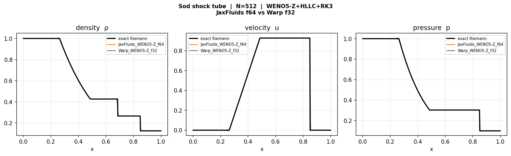
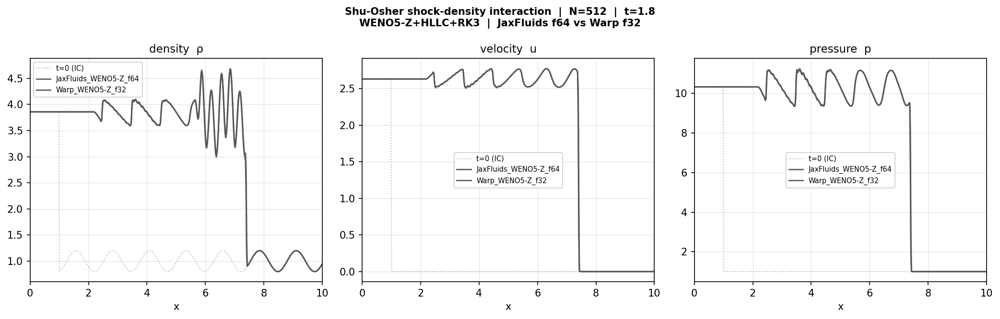
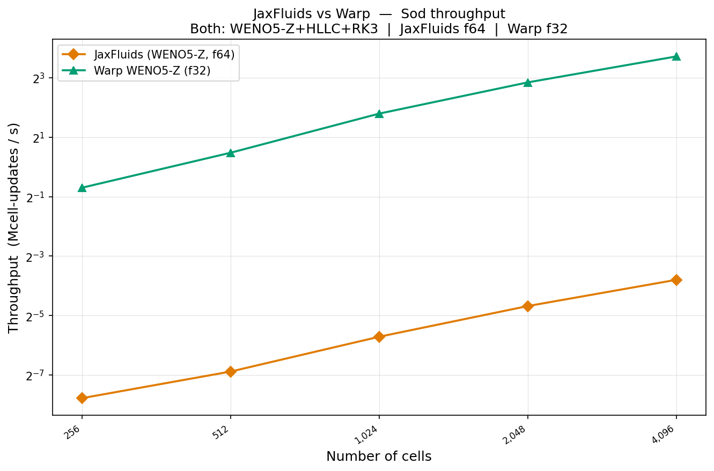

# warplabs-fluids

Experimental GPU-accelerated compressible flow solver built on [NVIDIA Warp](https://github.com/NVIDIA/warp).
Goal: a full Warp backend for [JaxFluids](https://github.com/tumaer/JAXFLUIDS) — same algorithm, same results, orders-of-magnitude faster on GPU.

**Phase 1 complete.** 1-D compressible Euler, WENO5-Z + HLLC + SSP-RK3, float32.

---

## Solver

| Component | Choice |
|---|---|
| Equations | 1-D compressible Euler  [ρ, ρu, E] |
| Reconstruction | WENO5-Z (Borges et al. 2008) |
| Riemann solver | HLLC (Toro 2009) |
| Time integration | SSP-RK3 (Shu & Osher 1988) |
| Ghost cells | ng = 3  (7-cell stencil) |
| Default CFL | 0.4 |
| Precision | float32 |

Matches JaxFluids' numerical scheme exactly — the only difference is float32 vs float64.

## Kernel architecture

Each fused kernel loads a 7-cell stencil, computes both interface fluxes in registers, and writes the RK update. No global flux array. BC handled inline (clamp for outflow, modulo for periodic).

```
fused_rk_stage_1d   1 launch per RK stage  (3 per timestep)
  thread i:
    load Q[i-3..i+3]         ← 7 cells from global memory
    WENO5-Z + HLLC → F_l     ← left interface, registers only
    WENO5-Z + HLLC → F_r     ← right interface, registers only
    Q_out[i] = RK update     ← single global write
```

---

## Install

```bash
pip install warp-lang numpy scipy matplotlib
```

---

## Quick start

```python
import numpy as np
from warplabs_fluids import WarpEuler1D, prim_to_cons

N, gamma = 512, 1.4
dx = 1.0 / N
x  = (np.arange(N) + 0.5) * dx

rho = np.where(x < 0.5, 1.0, 0.125)
u   = np.zeros(N)
p   = np.where(x < 0.5, 1.0, 0.1)
Q0  = prim_to_cons(rho, u, p, gamma)

solver = WarpEuler1D(N, dx, gamma=gamma, bc="outflow", scheme="weno5z-rk3")
solver.initialize(Q0)
solver.run(t_end=0.2, cfl=0.4)

rho_out = solver.state[0]
```

---

## Validation

Two canonical 1-D test cases, both run against JaxFluids (WENO5-Z + HLLC + SSP-RK3, float64).

### Sod shock tube

Membrane at x = 0.5 bursts at t = 0, producing a leftward rarefaction fan, a contact discontinuity, and a rightward shock. Exact Riemann solution available (Toro 2009).



Warp f32 and JaxFluids f64 produce **effectively identical results**. The 2.3% L1 difference is the cost of float32 vs float64 — negligible at shock-capturing accuracy where discretization error dominates.

| | L1(ρ) | L1(u) | L1(p) |
|---|---|---|---|
| JaxFluids f64 | 8.52e-4 | 1.87e-3 | 6.00e-4 |
| Warp f32 | 8.72e-4 | 1.90e-3 | 6.60e-4 |

Convergence slope: ~O(N⁻⁰·⁹⁵) for both — identical.

### Shu-Osher density wave

Mach-3 shock interacting with a sinusoidal density field. Designed by Shu & Osher (1989) to stress-test high-order schemes — post-shock fine structure requires low numerical dissipation to resolve.



---

## Performance

Benchmarks run on RTX 5000 Ada, WSL2 Ubuntu 22.04. Same GPU, same algorithm — apples-to-apples.

| Test case | Warp f32 | JaxFluids f64 | Speedup |
|---|---|---|---|
| Sod  (N = 4 096) | 13.1 Mcell/s | 0.07 Mcell/s | **183×** |
| Shu-Osher  (N = 4 096) | 12.5 Mcell/s | 0.11 Mcell/s | **111×** |
| Sod  (N = 131 072) | ~767 Mcell/s | — | — |

Peak throughput is still bandwidth-scaling at N = 131 072 — the GPU is not yet saturated.



**Memory footprint:** Warp holds a flat 32 MiB regardless of N (cudaMallocAsync pool, pre-allocated once). JaxFluids grows linearly with N.

---

## Tests

```bash
# From examples/warplabs_fluids/
python -m pytest tests/ -v
```

All tests run on Warp CPU — no CUDA required.

---

## Benchmarks

All scripts save CSV output so plots can be reproduced without re-running on GPU.

```bash
# Warp vs JaxFluids head-to-head (requires JaxFluids venv)
python benchmarks/sod/bench_jaxfluids.py
python benchmarks/shu_osher/bench_jaxfluids.py

# Warp-only N-sweep and memory (no JaxFluids needed)
python benchmarks/sod/throughput_memory.py
python benchmarks/shu_osher/throughput_memory.py

# Regenerate all plots from saved CSV (no GPU needed)
python benchmarks/sod/plot_from_csv.py
python benchmarks/shu_osher/plot_from_csv.py
```

---

## Roadmap

Long-term goal: a complete Warp GPU backend for JaxFluids — drop-in replacement, identical Python API, targeting 100× throughput at production scale.

| Phase | Status | Scope |
|---|---|---|
| 1 | ✅ **Complete** | 1-D Euler · WENO5-Z + HLLC + SSP-RK3 · Sod + Shu-Osher V&V · 183× vs JaxFluids |
| 2 | Next | 2-D Euler · Strang dimensional splitting · Kelvin-Helmholtz instability V&V |
| 3 | Planned | 3-D Euler · Rayleigh-Taylor + shock-vortex V&V · 3-D N³ scaling |
| 4 | Planned | Compressible Navier-Stokes · viscous + heat conduction · Taylor-Green vortex |
| 5 | Planned | Higher-order schemes · WENO7, TENO, MP-WENO · scheme comparison suite |
| 6 | Planned | Two-phase & interface methods · diffuse interface · bubble collapse V&V |
| 7 | Planned | Multi-GPU · domain decomposition (MPI/NCCL) · weak & strong scaling |
| 8 | Goal | Full JaxFluids Warp backend · drop-in Python API · open-source release |
